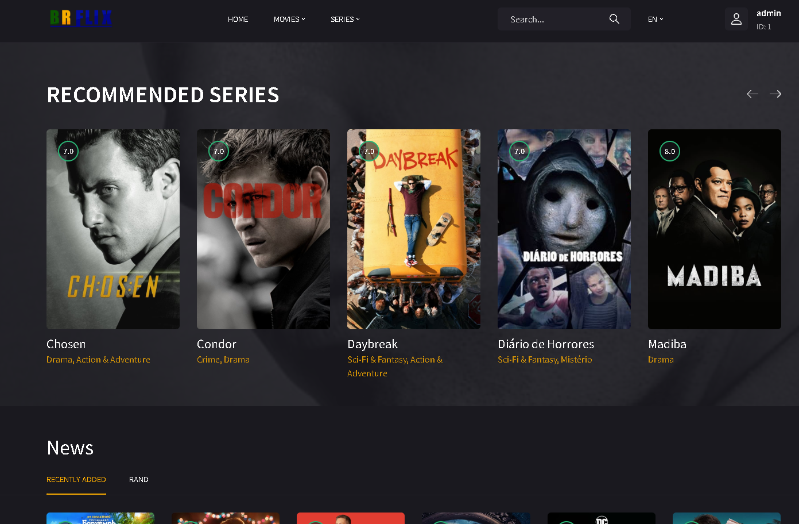

# BR-Flix (Xtream IPTV)

Just a project developed for studies, I hope you like it :D

Characteristics:
  - Own profile
  - Recently watched
  - list of favorites
  - Checkpoint (Saves your playing time)
  - Automatic next episode (Jumps to the next EP whenever the video reaches 99%)
  - Marking episodes already watched (Episodes that have already been watched are named green)
  - search bar
  - Browse movies and series by category
  - Multi languages ​​(Currently Portuguese/English, you can add a translation for the entire site just by modifying a few lines)
  - Update the list (Available only for users with level 10)

Requests:
  - Composer
  -Web server with URL rewriting
  - PHP 7.4 or higher (8.1 recommended)
  - IPTV list with Xtream API support

Information:
  - slimphp/Slim was used for route control and rendering, make sure to install correctly.
  - A default user will be created with the Database, user: admin password: 123 (This user already has level 10)
  - Make sure you configure your database in the `src/db.php` file
  - Write permission for the folder and all its files: `src/storage`

